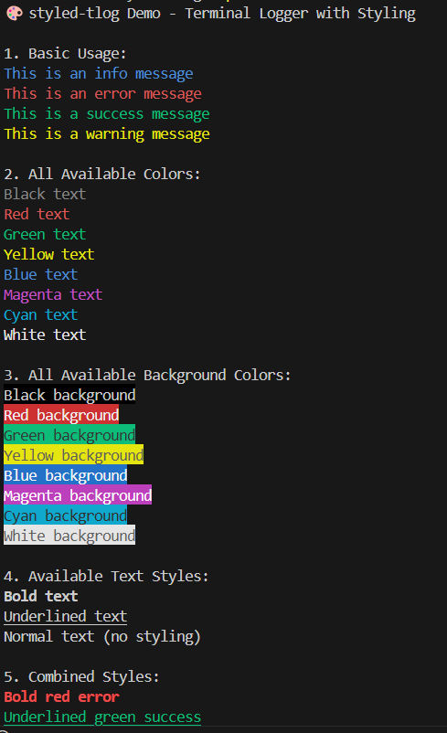
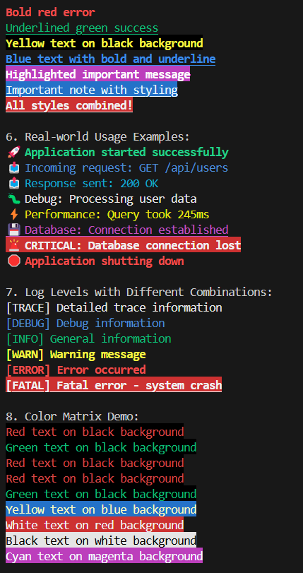

# styled-tlog

🎨 A terminal logger with style — define your log types with color, bold, background, etc. in a type-safe way.

## 🔧 Usage

```ts
import { createLogger } from "styled-tlog";

const logger = createLogger({
  success: { color: "green", bold: true },
  error: { color: "red", background: "white" }
});

logger.success("Operation was successful");
logger.error("Something went wrong");
```

## 📸 Output


## 🎨 Available Styles




